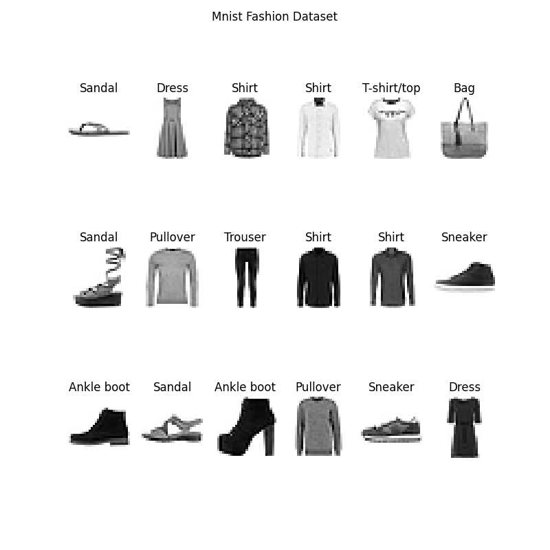

# MNIST Fashion Dataset covnet using Keras/Tensorflow 2.6

This is a mini project that aims to showcase my ability to read documention and my knowledge of covnet, keras, and lifecycle of a deep learning project.

The data is available at : [Data API from Keras](https://keras.io/api/datasets/fashion_mnist/)

Some documentaton is available at: [Classification Documentation](https://www.tensorflow.org/tutorials/keras/classification)

Library used: Keras/Tensorflow, Pandas, Numpy, Matplotlib, Pickle ..etc.

# Description

Train-Model is used to load in Fashion-Mnist dataset which is a dataset of 60000 28x28 grayscale images of 10 fashion categories.
The scripts loads the data, preprocess it (just scaling it down to values between 0-1) and creates a covnet of 5 hidden layer.

For example:

The layers consist of:

1. Flatenning of the 2D image into 1D vector
2. A Dense layer with 256 hidden nodes with Relu activation
3. A Dense layer with 128 hidden nodes with Relu activation
4. A Dense layer with 32 hidden nodes with Relu activation
5. Finally the output layer with 10 nodes usign Softmax since every category is mutually exclusive (This means that the sum of the probabilities of all possible outcomes should add up to 1 or in simple terms 1 image can only have 1 category).

Below is a summary of the covnet:

# Results

Below are a few screenshot showing some of the use cases of the program

The help toggle as well as the current options

An example run

To access the model:
[model.h5](results/Keras_CNN_model.h5)

# To do next:

1.  Host the model with AWS Sagemaker (in progress) - Just the endpoitn to make predictions
2.  Create a front end for users to be able to test their own image (if that's the case will need to add more layers such as convolutions and pooling since regular images are much higher quality and need some additional preprocessing.)
